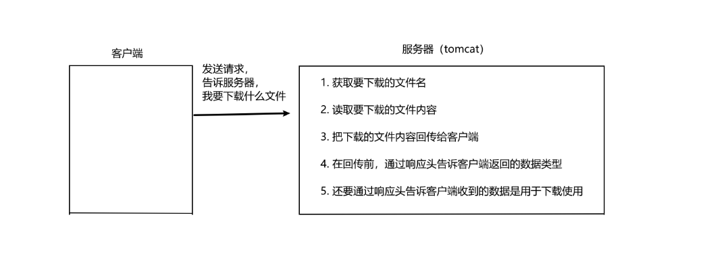

## 文件上传和下载

### 文件上传：

1. 要有一个 form 标签，method=post 请求
2. form 标签的 encType 属性值必须为 multipart/form-data 值
3. 在 form 标签中使用 input type=file 添加上传的文件
4. 编写服务器代码（servlet程序）接收，处理上传数据


```jsp
<%@ page contentType="text/html;charset=UTF-8" language="java" %>
<base href="http://192.168.2.23:8080/EL_JSTL/">
<html>
<head>
    <title>UploadAndDownload_index</title>
</head>
<body>
<form action="upload" method="post" enctype="multipart/form-data">
    <input type="file" name="filename"><br>
    <input type="submit" value="上传"><br>
</form>
</body>
</html>
```

```xml
<?xml version="1.0" encoding="UTF-8"?>
<web-app xmlns="https://jakarta.ee/xml/ns/jakartaee"
         xmlns:xsi="http://www.w3.org/2001/XMLSchema-instance"
         xsi:schemaLocation="https://jakarta.ee/xml/ns/jakartaee https://jakarta.ee/xml/ns/jakartaee/web-app_6_0.xsd"
         version="6.0">
    <servlet>
        <servlet-name>upload</servlet-name>
        <servlet-class>com.chr.UploadAndDownload.upload</servlet-class>
    </servlet>
    <servlet-mapping>
        <servlet-name>upload</servlet-name>
        <url-pattern>/upload</url-pattern>
    </servlet-mapping>
</web-app>
```

enctype="multipart/form-data" 表示提交的数据，以多段的形式进行拼接（每一个表单项一个数据段），然后以二进制流的形式发送给服务器。


上传的文件是以流的形式传到服务器的，服务器要以流的形式接收处理。

```java
// 获取请求对象的输入流，用于读取客户端发送的数据
ServletInputStream inputStream = req.getInputStream();
// 创建一个字节数组缓冲区，用于存储读取的数据，大小为102400字节
byte[] buffer = new byte[102400];
// 从输入流中读取数据到缓冲区，返回实际读取的字节数
int read = inputStream.read(buffer);
// 将读取的字节数组转换为字符串，并打印输出，只转换实际读取的字节
System.out.println(new String(buffer, 0, read));
```


##### 使用 commons-fileupload.jar 处理上传的数据：

需要导入两个jar包：commons-fileupload-1.2.1.jar，commons-io-1.4.jar

|       类名        |         功能         |
| :---------------: | :------------------: |
| ServletFileUpload | 用于解析上传的数据。 |
|     FileItem      |  表示每一个表单项。  |

> boolean ServletFileUpload.isMultipartContent(HttpServletRequest request);
>
> 判断当前上传的数据格式是否是多段的格式。如果不是多段格式无法解析

> public List <FileItem>  parseRequest(HttpServletRequest request)
>
> 解析上传的数据

>boolean FileItem.isFormField()
>
>判断当前这个表单项，是否是普通的表单项。还是上传的文件类型。
>true 表示普通类型的表单项
>false 表示上传的文件类型

>String FileItem.getFieldName()
>
>获取表单项的 name 属性值

> String FileItem.getString()
>
> 获取当前表单项的值。

>String FileItem.getName();
>
>获取上传的文件名

>void FileItem.write( file );
>
>将上传的文件写到 参数 file 所指向抽硬盘位置 。


### 文件下载：



```java
package com.chr.UploadAndDownload;

import jakarta.servlet.ServletContext;
import jakarta.servlet.ServletException;
import jakarta.servlet.ServletOutputStream;
import jakarta.servlet.http.HttpServlet;
import jakarta.servlet.http.HttpServletRequest;
import jakarta.servlet.http.HttpServletResponse;
import org.apache.commons.io.IOUtils;

import java.io.IOException;
import java.io.InputStream;
import java.io.OutputStream;

/**
 * @Author: 程浩然
 * @Create: 2024/7/23 - 21:15
 * @Description: 文件下载
 */
public class Download extends HttpServlet {
    @Override
    protected void doGet(HttpServletRequest req, HttpServletResponse resp) throws ServletException, IOException {
        // 获取下载文件名
        String downloadFileName = "1.png";
        // 读取要下载的文件内容（通过 servletContext 对象可以读取）
        ServletContext servletContext = getServletContext();
        // 获取要下载的文件类型
        String mimeType = servletContext.getMimeType("/file/" + downloadFileName);
        // 通过响应头告诉客户端返回的数据类型
        resp.setContentType(mimeType);
        // 通过响应头告诉客户用户是用于下载的
        resp.setHeader("Content-Disposition", "attachment; filename=" + downloadFileName);
        // 获取响应输入流
        InputStream resourceAsStream = servletContext.getResourceAsStream("/file/" + downloadFileName);
        // 获取响应输出流
        OutputStream outputStream = resp.getOutputStream();
        // 读取输入流全部数据，复制给输出流，输出给客户端
        IOUtils.copy(resourceAsStream, outputStream);

    }
}
```


##### 文件名为中文是谷歌无法识别解决方法：

```java
resp.setHeader("Content-Disposition", "attachment; filename=" + URLEncoder.encode("在.png", "UTF-8"));
```
