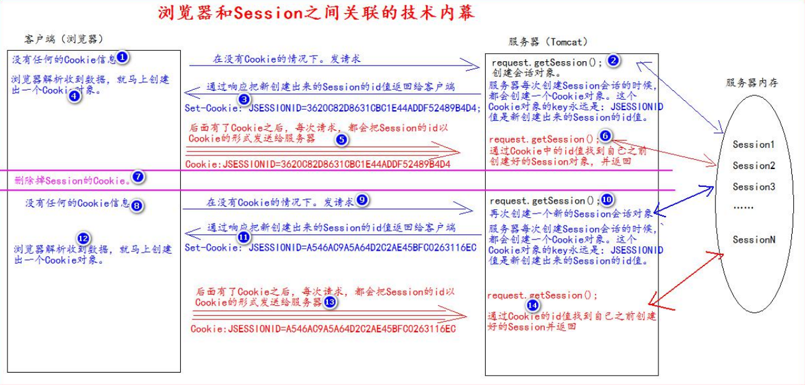

## Session

### 什么是Session：

1. Session 就一个接口（HttpSession）。
2. Session 就是会话。它是用来维护一个客户端和服务器之间关联的一种技术。
3. 每个客户端都有自己的一个 Session 会话。
4. Session 会话中，我们经常用来保存用户登录之后的信息。
5. Cookie 保存在客户端，Session 保存在服务器。


### 创建和获取Session：

通过`request.getSession()`来创建和获取Session。

第一次调用是创建Session会话。
之后再调用是获取前面创建好的Session会话对象。

`isNew()`方法用来判断到底是不是新创建的会话对象。

- true：是刚创建的
- false：是获取之前创建的

每一个会话都会有一个身份证号，也就是 ID 值，这个ID值唯一，`getId()`这个方法可以得到Session的会话Id值。

```java
package com.chr.session;


import jakarta.servlet.ServletException;
import jakarta.servlet.http.HttpServlet;
import jakarta.servlet.http.HttpServletRequest;
import jakarta.servlet.http.HttpServletResponse;

import java.io.IOException;
import java.lang.reflect.Method;

public abstract class BaseServlet extends HttpServlet {

    @Override
    protected void doGet(HttpServletRequest req, HttpServletResponse resp) throws ServletException, IOException {
        doPost(req, resp);
    }

    protected void doPost(HttpServletRequest req, HttpServletResponse resp) throws ServletException, IOException {
        // 解决post请求中文乱码问题
        // 一定要在获取请求参数之前调用才有效
        req.setCharacterEncoding("UTF-8");
        // 解决响应中文乱码问题
        resp.setContentType("text/html; charset=UTF-8");

        String action = req.getParameter("action");
        try {
            // 获取action业务鉴别字符串，获取相应的业务 方法反射对象
            Method method = this.getClass().getDeclaredMethod(action, HttpServletRequest.class, HttpServletResponse.class);
//            System.out.println(method);
            // 调用目标业务 方法
            method.invoke(this, req, resp);
        } catch (Exception e) {
            e.printStackTrace();
        }
    }

}
```

```java
public class SessionServlet extends BaseServlet {
    protected void createOrGetSession(HttpServletRequest req, HttpServletResponse resp) throws ServletException, IOException {
        HttpSession session = req.getSession();
        if (session.isNew()) {
            resp.getWriter().write("刚创建的<br>");
        } else {
            resp.getWriter().write("之前创建的<br>");
        }
        resp.getWriter().write("id是 " + session.getId());
    }
}
```


### Session的生命周期控制：

> public void setMaxInactiveInterval(int interval) 
>
> 设置 Session 的超时时间（以秒为单位），超过指定的时长，Session就会被销毁。
>
> 值为正数的时候，设定 Session 的超时时长。
> 负数表示永不超时（极少使用）

> public int getMaxInactiveInterval()
>
> 获取 Session 的超时时间

> public void invalidate()
>
> 让当前 Session 会话马上超时无效。

默认超时时长为：1800s，即30min

可以在项目的web.xml中修改超时时长

```xml
<session-config>
    <session-timeout>20</session-timeout>
</session-config>
```


### 浏览器和Session之间关联的技术内幕：



Session 技术，底层其实是基于 Cookie 技术来实现的。

是通过Cookie的`JSESSIONID`值来进行认领session。如果清楚Cookie，那么在发送给服务器时就不会携带`JSESSIONID`，服务器就只能重新创建一个会话（在服务器内存中重新划分出区域给会话使用），然后回传会话ID。
